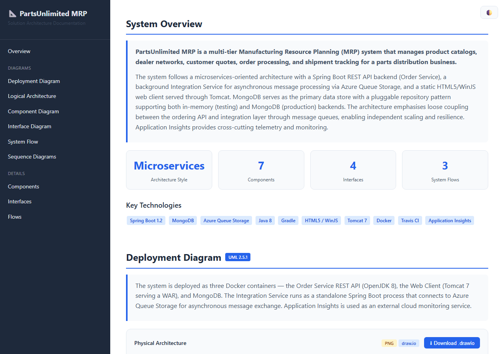
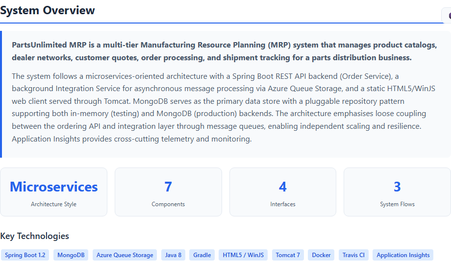
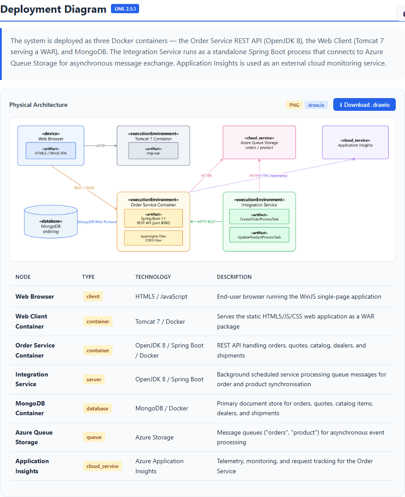
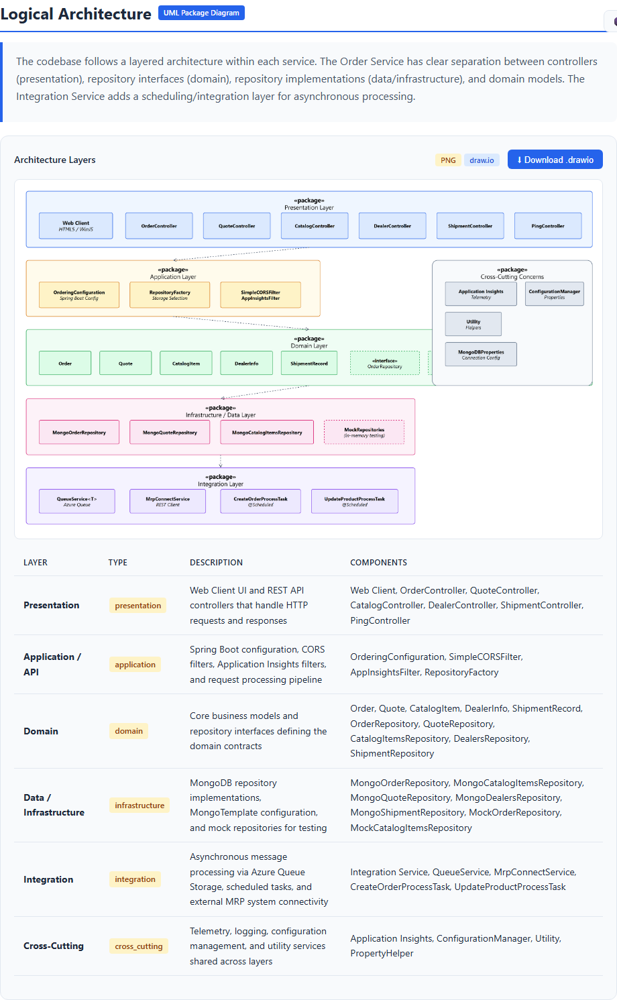
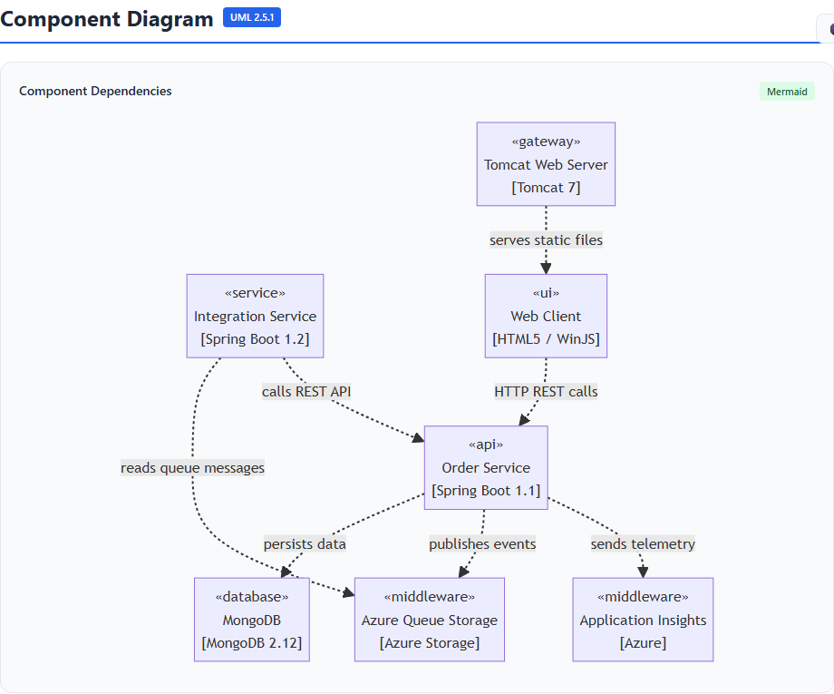
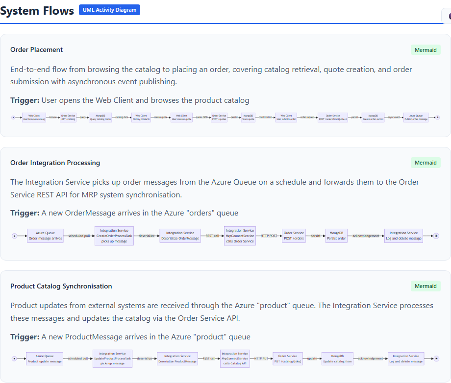
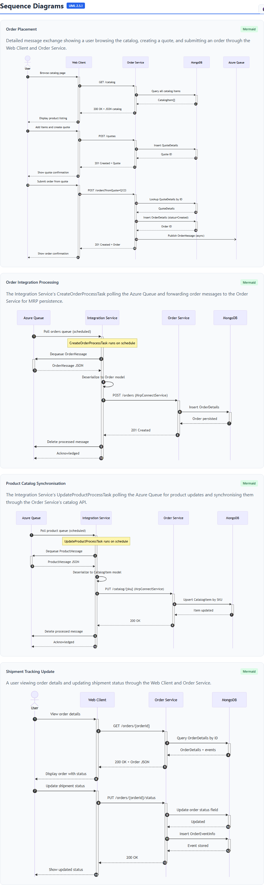

# CodeDoc

**Generate Solution Architecture documentation from any codebase — powered by GitHub Copilot.**

CodeDoc is a **GitHub Copilot agent** that scans a codebase, analyses its architecture, and produces a self-contained interactive HTML report with UML 2.5.1-compliant diagrams.



---

## What It Does

Point CodeDoc at any codebase and it will:

1. **Scan** — Walk the file tree, detect languages, frameworks, symbols, API endpoints, and infrastructure config
2. **Analyse** — Reason about physical architecture, logical layers, components, interfaces, system flows, and sequence interactions
3. **Audit** — Detect deprecated/unused code, analyse Infrastructure as Code (per environment), and map CI/CD pipelines
4. **Generate Diagrams** — Produce Draw.io XML and Mermaid UML 2.5.1-compliant diagrams, then export Draw.io diagrams to PNG
5. **Build Report** — Assemble everything into a single self-contained HTML report and PDF

### Output

```
codedoc-output/
├── architecture-report.html    ← Open in browser
├── architecture-report.pdf     ← Solution Architecture Document (PDF)
├── deployment.drawio           ← UML Deployment Diagram
├── deployment.png              ← PNG render (embedded in report)
├── logical.drawio              ← UML Package Diagram
├── logical.png                 ← PNG render (embedded in report)
├── component.drawio            ← UML Component Diagram
├── interface.drawio            ← UML Interface Diagram
├── interface.png               ← PNG render (embedded in report)
├── system_flow.drawio          ← UML Activity Diagram
├── sequence.drawio             ← UML Sequence Diagram
├── component_overview.mmd      ← Mermaid component flowchart
├── flow_{id}.mmd               ← Mermaid flow diagrams
└── sequence_{id}.mmd           ← Mermaid sequence diagrams
```

### Diagram Types

| Diagram | Format | Visual in Report |
|---------|--------|-----------------|
| Deployment (Physical Architecture) | Draw.io XML → **PNG** | Inline PNG image |
| Logical (Package/Layers) | Draw.io XML → **PNG** | Inline PNG image |
| Interface (Integration Points) | Draw.io XML → **PNG** | Inline PNG image |
| Component Dependencies | Draw.io XML + **Mermaid** | Mermaid rendered |
| System Flows (Activity) | Draw.io XML + **Mermaid** | Mermaid rendered |
| Sequence Diagrams | Draw.io XML + **Mermaid** | Mermaid rendered |

---

## Prerequisites

- **GitHub Copilot CLI** — CodeDoc runs as a Copilot agent
- **draw.io desktop** — required for PNG diagram export ([download](https://github.com/jgraph/drawio-desktop/releases))

---

## Setup

1. Copy [`codedoc.agent.md`](codedoc.agent.md) to your Copilot agents directory:

   ```
   # Windows
   %USERPROFILE%\.copilot\agents\codedoc.agent.md

   # macOS / Linux
   ~/.copilot/agents/codedoc.agent.md
   ```

2. Install [draw.io desktop](https://github.com/jgraph/drawio-desktop/releases) for PNG export.

3. Invoke CodeDoc from the Copilot CLI:

   ```
   @codedoc analyse this codebase
   ```

---

## Usage

Once the agent is installed, invoke it from GitHub Copilot CLI:

```
# Analyse the current directory
@codedoc analyse this codebase

# Analyse a specific path
@codedoc analyse C:\code\my-project

# Analyse a GitHub repo
@codedoc analyse https://github.com/org/repo
```

CodeDoc will scan the codebase, generate all diagrams, and produce `architecture-report.html` in a `codedoc-output/` directory. Open it in your browser.

---

## How It Works

CodeDoc executes a **5-phase pipeline**:

```
Phase 1: SCAN      → Walk the codebase, collect structural facts
Phase 2: ANALYSE   → Reason about architecture (overview, components, layers, flows)
Phase 3: DIAGRAM   → Generate Mermaid + Draw.io XML diagrams
Phase 3b: PNG      → Export Draw.io diagrams to PNG (required for deployment, logical, interface)
Phase 4: REPORT    → Assemble a self-contained HTML file with embedded diagrams
Phase 5: PDF       → Export the HTML report to PDF (Solution Architecture Document)
```

### Phase 1 — Scan

The agent uses `glob`, `grep`, and `view` tools to:

- Discover all source files (skipping `node_modules`, `__pycache__`, `dist`, etc.)
- Detect languages from file extensions
- Identify frameworks (Django, Spring Boot, ASP.NET, React, Express, etc.)
- Extract key symbols (classes, functions, interfaces)
- Find API endpoints (REST, gRPC, GraphQL, WebSocket)
- Classify config files (Docker, K8s, CI/CD, IaC)

### Phase 2 — Analyse

Using the scanned facts, the agent reasons about:

- **System Overview** — purpose, architecture style, key technologies
- **Physical Architecture** — deployment nodes and connections
- **Logical Architecture** — layers (presentation, application, domain, infrastructure)
- **Components** — services, libraries, APIs, workers, databases
- **Interfaces** — integration points, contracts, endpoints
- **System Flows** — end-to-end request paths
- **Sequence Diagrams** — detailed component interactions
- **Deprecated/Unused Code** — dead code, unused imports, commented-out blocks, legacy patterns
- **Infrastructure as Code** — Terraform, Bicep, ARM, CloudFormation, Pulumi, Helm, Docker, K8s configs grouped by environment (dev/test/staging/prod), with **Draw.io cloud infrastructure diagrams** per environment exported to PNG
- **CI/CD Pipelines** — GitHub Actions, Azure DevOps, Jenkins, GitLab CI pipeline stages, triggers, quality gates, deployment strategy

### Phase 3 — Diagrams

Generates UML 2.5.1-compliant diagrams in two formats:

- **Draw.io XML** (`.drawio`) — All 6 diagram types using mxGraph shapes
- **Mermaid** (`.mmd`) — Sequence, flow, and component diagrams

Then exports Draw.io diagrams to **PNG** using the draw.io desktop CLI. PNG is **required** for deployment, logical, and interface diagrams (which have no Mermaid equivalent).

### Phase 4 — Report

Assembles a single `architecture-report.html` with:

- Interactive sidebar navigation
- Light/dark theme toggle
- Embedded PNG diagrams for physical and logical architecture
- Mermaid diagrams for sequences and flows (rendered client-side)
- Data tables for nodes, layers, components, interfaces, and flow steps
- Deprecated/unused code findings with severity ratings
- Infrastructure as Code inventory grouped by environment
- CI/CD pipeline analysis with stages, triggers, and deployment strategy
- Download buttons for `.drawio` files
- Print-friendly CSS for PDF export

### Phase 5 — PDF

Exports the HTML report to `architecture-report.pdf` using a headless browser (Edge, Chrome, or Playwright). The PDF hides the sidebar navigation and formats the content for A4 paper — suitable for sharing as a formal Solution Architecture Document.

### Supported Languages

| Language | Detection |
|----------|-----------|
| Python | Classes, functions, Flask/FastAPI/Django routes, SQLAlchemy/Django ORM |
| JavaScript/TypeScript | Classes, interfaces, Express/NestJS/Next.js routes, Prisma/TypeORM/Sequelize |
| C# | Classes, interfaces, ASP.NET/Minimal APIs/gRPC/SignalR, EF Core/Dapper |
| Java | Classes, interfaces, Spring/JAX-RS/gRPC endpoints, JPA/Hibernate/MyBatis |
| Go, Rust, Ruby, PHP, Swift, Kotlin, Scala | Language detection and framework identification |

---

## Project Structure

```
CodeDoc/
├── agent-codedoc/
│   └── codedoc.agent.md    ← The Copilot agent definition (install this)
└── README.md
```

The agent file contains the complete pipeline instructions, HTML template, diagram generation rules, and UML notation reference — everything Copilot needs to analyse a codebase and produce the report.

---

## Example Output

After running CodeDoc against a Java/Spring Boot codebase:

```
✓ Found 180 files, 24,000 lines
✓ Languages: Java, JavaScript, CSS
✓ Frameworks: Spring Boot, Gradle

✓ System Overview
✓ Physical Architecture (8 nodes)
✓ Logical Architecture (5 layers)
✓ Components (12)
✓ Interfaces (6)
✓ System Flows (3)
✓ Sequence Diagrams (4)

✓ 6 Draw.io XML diagrams
✓ 8 Mermaid diagrams
✓ 3 PNG exports (deployment, logical, interface)

✓ architecture-report.html — open in browser
```

### Report Screenshots

**System Overview** — architecture style, key technologies, and stats at a glance:



**Deployment Diagram** — UML 2.5.1 physical architecture rendered as PNG from Draw.io:



**Logical Architecture** — UML package diagram showing layers and component groupings:



**Component Diagram** — Mermaid-rendered component dependency flowchart:



**System Flows** — Mermaid activity diagrams for end-to-end request paths:



**Sequence Diagrams** — Mermaid UML sequence diagrams with numbered messages:



---

## License

See [LICENSE](LICENSE) for details.
